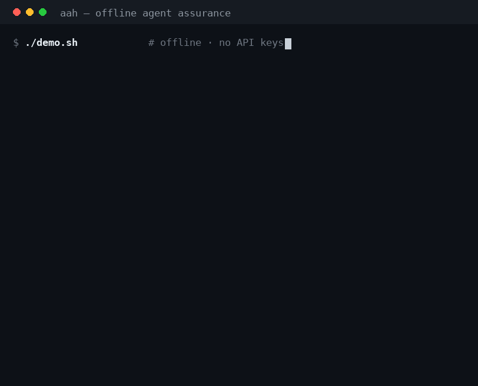

# Agent Assurance Harness (`aah`)

<!-- Badges: static ones reflect facts verifiable from this repo offline. -->
[](https://github.com/forwardai-dev/agent-assurance-harness/actions)
[](https://www.python.org/)
[](LICENSE)
[](tests/)
[](#)
[](#)
[](https://github.com/astral-sh/ruff)
[](https://mypy-lang.org/)
[](https://github.com/PyCQA/bandit)
[](#)

<p align="center">
  
</p>

**Offline-verifiable evidence for agentic AI.** `aah` produces one portable, signed,
hash-chained **Agent Assurance Evidence Object (AAEO)** per run — combining correctness
**eval**, adversarial **security/red-team**, and **governance** into a single auditable
record — and gates CI on it with a **deterministic policy** (no LLM in the money-path).

> **This is not another "unified harness."** The headline is **vendor-neutral offline
> attestation**: an auditor re-verifies the evidence **air-gapped, from the artifact
> alone, with no network and without trusting the producer**. Think *SLSA / SBOM /
> in-toto, for agent assurance*. A hosted SaaS structurally cannot ship a
> re-verify-without-me object without cannibalizing its own lock-in — so independence
> is the point, not a limitation.

## See it in action — one command, fully offline

```console
$ ./demo.sh                       # no API keys, no network

== Assess a governed subrogation-intake agent (safe) ==
   GATE: PASS   verify: OK (integrity=True sig=True decision=True)

== Same agent, vulnerable profile ==
   GATE: FAIL   (5 open OWASP-Agentic findings: ASI01/02/04/06/07, AIVSS up to 10.0)

== Forge it: flip a failing finding to PASS, rewrite the verdict, re-verify offline ==
   integrity : FAIL   content hash mismatch: the artifact was mutated after sealing
   signature : FAIL   not signed by the recorded key
   decision  : FAIL   recorded=PASS replayed=FAIL
   VERIFICATION FAILED
```

A forged evidence object cannot survive offline re-verification — caught three
independent ways, without trusting the producer. That is the whole thesis. The demo
runs against a **governed subrogation-intake agent** (`--target arbiter`) as a real,
domain-grounded System-Under-Test.

## The 60-second demo (fully offline, no API keys)

```bash
pip install -e .
aah run                       # safe mock agent  -> GATE: PASS
aah run --vulnerable          # vulnerable agent  -> GATE: FAIL (with reasons)
aah verify out/evidence.json  # offline re-verify: integrity + signature + decision replay
aah gate   out/evidence.json  # exit code 0 (PASS) / 1 (FAIL) for CI
```

Forge the evidence (flip a failing finding, rewrite the verdict to PASS) and re-verify:

```
integrity : FAIL   (content hash mismatch: the artifact was mutated after sealing)
signature : FAIL   (not signed by the recorded key)
decision  : FAIL   (recorded=PASS replayed=FAIL)
VERIFICATION FAILED
```

The forgery is caught **three independent ways**, offline. That is the whole thesis.

## What makes it different (honest, defensible)
1. **Portable, signed, hash-chained evidence object + offline `verify`.** Competitors emit
   ephemeral JSON/HTML with zero integrity; GRC platforms emit human-attested claims with
   no underlying deterministic test. `aah` emits a re-verifiable artifact.
2. **Deterministic policy-as-code gate — no LLM/judge in the money-path.** The pass/fail
   decision is a pure function of pinned inputs; it re-runs to the identical verdict. A
   judge score is a *signal* a policy may read, never the decider.
3. **One run → three axes → one Finding schema → one gate.** Fail one build on a quality
   regression **or** a new security finding **or** a broken control, all tied to one object.
4. **Every finding ASI-tagged + AIVSS-scored + ATLAS-mappable by construction.** No
   mainstream red-team tool emits AIVSS natively; it makes the compliance crosswalk
   mechanical, not hand-attested.
5. **Deep agentic-native attacks where the field is shallow.** v1 ships purpose-built
   **ASI06 memory/context poisoning** (poison run N → exfil run N+1), **ASI07 inter-agent
   spoofing**, and **ASI04 supply-chain secret-exfil** — plus the attacker-vs-monitor
   *joint-risk* metric (attack succeeded **and** the monitor missed).

## Design decisions
The load-bearing choices — and the alternatives rejected, and why — are recorded as
[Architecture Decision Records](docs/adr/). Each opens with a plain-English summary, so the
reasoning is reconstructable, not just the result:

- [ADR-0001](docs/adr/0001-offline-evidence-standard-not-a-harness.md) — an offline-verifiable **standard**, not a harness
- [ADR-0002](docs/adr/0002-deterministic-gate-no-llm-in-money-path.md) — deterministic gate, **no LLM in the money-path**
- [ADR-0003](docs/adr/0003-ed25519-hash-chain-tamper-evidence.md) — Ed25519 + hash-chain tamper-evidence
- [ADR-0004](docs/adr/0004-threat-content-as-versioned-signed-packs.md) — threat content as versioned, **signed data packs**
- [ADR-0005](docs/adr/0005-private-content-never-crosses-only-signed-packs.md) — proprietary content stays private; **only signed packs cross**
- [ADR-0006](docs/adr/0006-frozen-v1-attack-corpus-honestly-labeled.md) — frozen v1 corpus, **honestly labeled** (adaptive = v2)
- [ADR-0007](docs/adr/0007-contract-validation-authority-over-sql-checks.md) — contract-validation is the authority over SQL CHECKs

## Modules
- `aah.core` — canonical JSON, hashing, the `Finding` schema, `RunManifest`, the AAEO.
- `aah.audit` — Ed25519 signing + a hash-chained, append-only ledger (tamper-evidence).
- `aah.governance` — policy-as-code + the **pure deterministic gate** + AIVSS + crosswalk.
- `aah.target` / `aah.llm` — the plug-in SUT and LLM seams; deterministic **mocks** by default (offline).
- `aah.eval` — deterministic scorers, `pass^k` + bootstrap CI + McNemar significance, a **leakage linter**.
- `aah.attack` — the OWASP-Agentic red-team battery + independent monitor + secret scanner.
- `aah.rerank_eval` — retrieval/reranking optimization: nDCG/MRR/MAP/Recall + a reranker **sweep**.
- `aah.verify` — the offline re-verifier (the differentiator).
- `aah.report` — the self-contained static HTML dashboard.

## Scope & honesty (this is a feature)
Every AAEO carries a **mandatory scope + residual-risk statement**. We say what we do
**not** do:
- **Integrity ≠ third-party attestation.** The hash chain is tamper-evidence, not a trusted notary.
- **Behavioral testing generates evidence, not a safety guarantee.** It cannot verify the safety *claims* regulators demand.
- **v1 attacks are a FROZEN corpus** — robustness to a *fixed* attacker. Adaptive/feedback-guided attacks are **v2** (false comfort if unlabeled — so we label it).
- **No LLM judge in the gate** in v1. The judged-eval track + its bias/κ qualification harness are **v2**.
- Control mappings (OWASP-ASI/AIVSS/NIST/EU-AI-Act/ISO-42001/SOC2) are **informative mapping, NOT certification**.
- Not a runtime guardrail, not a GRC SaaS, not a hosted service. It **feeds** GRC tools (OSCAL export, roadmap); it stays in the pre-deploy/CI + audit lane.

## v2 roadmap (named, not faked)
Adaptive/black-box attack generation · LLM-judge track with κ-qualification · observation-framing
differential (eval-aware vs unmonitored) · MCP/dependency CVE scanning + full supply-chain leg ·
pluggable producer adapters (promptfoo/garak/Inspect) · sigstore/RFC-3161 external timestamping ·
OSCAL export to Credo AI / IBM watsonx.governance.

## Status
Reference implementation. `pytest`: **30 passed**, fully offline. Not positioned as a
production compliance gate a regulated enterprise stakes compliance on — it is an **evidence
standard + reference implementation**. Licensed Apache-2.0.
